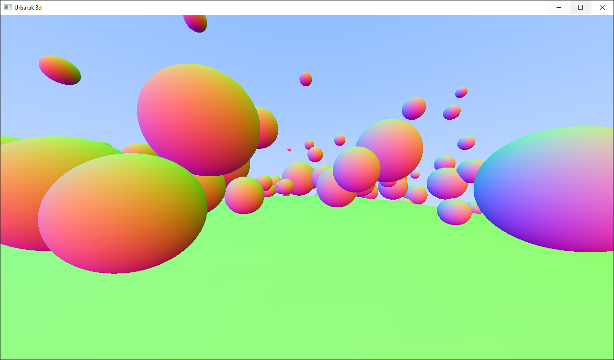

I wrote this project as a hobby just to educate myself and practice working with 3D vectors and whatnot. Unfortunately it didn't go that well, ended up trying to write an entity component system and couldn't figure it out within the time I had for the project.

There's a simple raytracer in the fragment shader inspired by a "software raytracer" tutorial.

It's intended to use billboard sprites for enemy characters (like Wolfenstein 3D).

It renders 3D spheres, renders billboard sprites (they're distorted from some angles), and has WASD+mouselook camera controls.

This project started out by following these tutorials:

* https://www.youtube.com/watch?v=W3gAzLwfIP0&list=PLlrATfBNZ98foTJPJ_Ev03o2oq3-GGOS2
* https://raytracing.github.io/books/RayTracingInOneWeekend.html

Uses GLFW, GLEW, and OpenGL 4.0

Wrote a blog article about a bug I encountered: [Raw Pointers to std::vector elements](https://medium.com/@Carl_Maxwell/raw-pointers-to-std-vector-elements-bcf6b2f70747)
